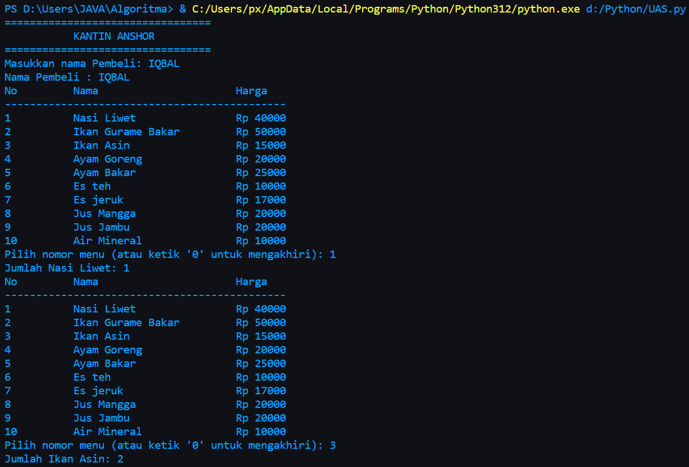
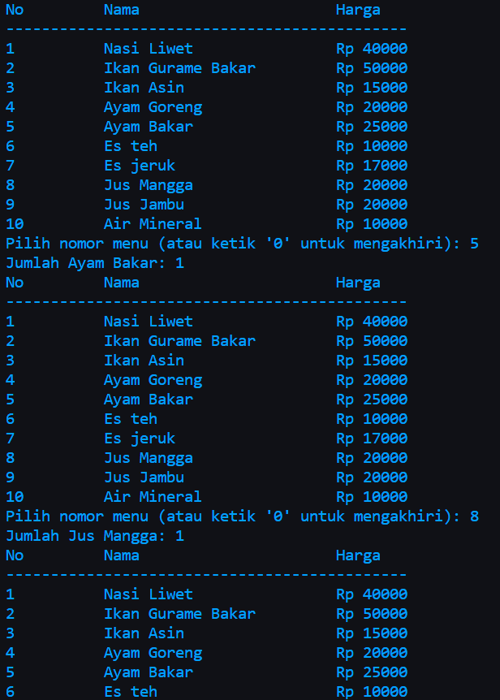
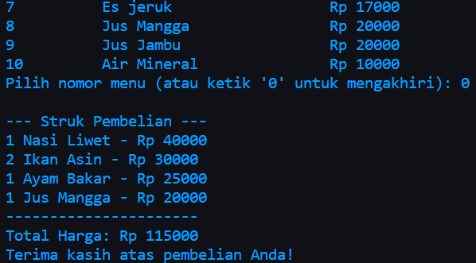

# Project UAS

| NAMA  :| M IQBAL AL ANSHORI |
| --- | --- |
| NIM   :| 312310659 |
| KELAS :| TI.23.A.6 |
| DOSEN :| Agung Nugroho,S.Kom.,M.Kom |

<Hr>

# Tugas Project Ujian Akhir Semester

## **Program Kasir Di Sebuah Kantin**<br>

|Link Youtube|  |
| --- | --- |

# Code Program Python


# Hasil Program Python




# $${\color{red}PENJELASAN}$$

1. Dictionary Harga Menu Makanan dan Minuman
Pada bagian awal program, terdapat sebuah dictionary yang menyimpan opsi pilihan makanan/minuman beserta harganya. Setiap item dalam dictionary berisi nama makanan/minuman sebagai kunci (key) dan harga sebagai nilai (value).
```python
menu = {
    '1' : {'item': 'Nasi Liwet',        'harga': 40000},
    '2' : {'item': 'Ikan Gurame Bakar', 'harga': 50000},
    '3' : {'item': 'Ikan Asin',         'harga': 15000},
    '4' : {'item': 'Ayam Goreng',       'harga': 20000},
    '5' : {'item': 'Ayam Bakar',        'harga': 25000},
    '6' : {'item': 'Es teh',            'harga': 10000},
    '7' : {'item': 'Es jeruk',          'harga': 17000},
    '8' : {'item': 'Jus Mangga',        'harga': 20000},
    '9' : {'item': 'Jus Jambu',         'harga': 20000},
    '10': {'item': 'Air Mineral',       'harga': 10000},
}
```

2. Fungsi tampilkan_menu():
Fungsi ini digunakan untuk menampilkan opsi makanan/minuman beserta harganya kepada pengguna. Fungsi ini menggunakan loop untuk mencetak setiap item dalam dictionary menu.
```python
def tampilkan_menu(daftar):
    print("{:<10} {:<25} {:<15}".format('No', 'Nama', 'Harga'))
    print("---------------------------------------------")
    for nomor, detail in daftar.items():
        print("{:<10} {:<25} Rp {:<15}".format(nomor, detail['item'], detail['harga']))
```

3. Fungsi Pesan_Makanan():
Fungsi ini merupakan awal dari sebuah fungsi untuk memesan makanan.
```python
def pesan_makanan():
    pesanan = {}
    while True:
        tampilkan_menu(menu)
        pilihan = input("Pilih nomor menu (atau ketik '0' untuk mengakhiri): ")
        
        if pilihan.lower() == '0':
            break
        
        if pilihan in menu:
            jumlah = int(input(f"Jumlah {menu[pilihan]['item']}: "))
            pesanan[menu[pilihan]['item']] = {'jumlah': jumlah, 'harga': menu[pilihan]['harga']}
        else:
            print("Pilihan tidak valid. Silakan pilih nomor menu yang benar.")
    return pesanan
```
4. Fungsi hitung_total(pesanan):
Fungsi ini digunakan untuk menghitung total biaya dari suatu pesanan. Fungsi ini mengambil satu parameter, yaitu pesanan, yang seharusnya berupa sebuah kamus (dictionary) yang berisi informasi tentang item-item pesanan.
```python
def hitung_total(pesanan):
    total = 0
    for item, info in pesanan.items():
        total += info['jumlah'] * info['harga']
    return total
```
5. Fungsi cetak_struk(pesanan, total_harga):
Fungsi ini bertujuan untuk mencetak struk pembelian berdasarkan informasi pesanan dan total harga yang diberikan sebagai argumen.
```python
def cetak_struk(pesanan, total_harga):
    print("\n--- Struk Pembelian ---")
    for item, info in pesanan.items():
        print(f"{info['jumlah']} {item} - Rp {info['jumlah'] * info['harga']}")
    print("----------------------")
    print(f"Total Harga: Rp {total_harga}")
    print("Terima kasih atas pembelian Anda!")
```
6.  Panggilan Fungsi Utama (if __name__ == "__main__":):
Baris ini memastikan bahwa fungsi main() akan dijalankan ketika program dieksekusi.
```python
if __name__ == "__main__":
    main()
```
